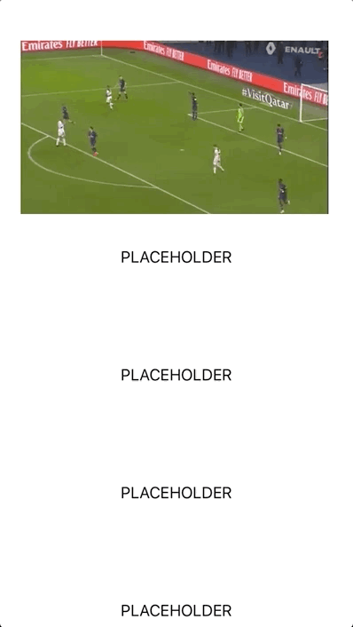
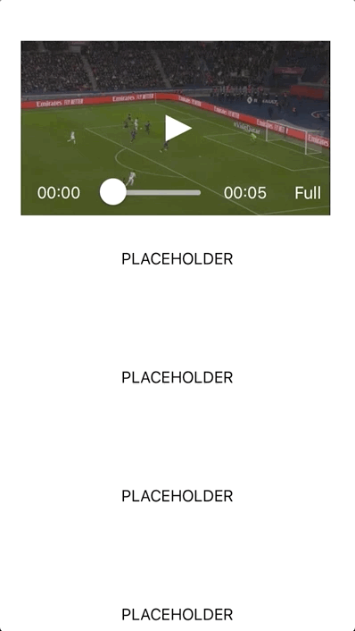

# Dioptra

RX based Library for managing different video playback types.

## Installation

```ruby
pod 'Dioptra/AV', '~> 1.0'
```

## Main concept

The main idea behind this library is to separate controls view and playback view to let the client use the same interface for playback. In this case, you are able to put custom overlay controls over different playback sources (like native or Dailymotion, for example). Both controls and playback views also connected with viewModel to separate logic from presentation.

Here is the interface of playback source, which gives the user the ability to perform the main manipulation to perform, like seek, progress and play/pause. Get/set playback muted, rate or available qualities:

```swift
public protocol VideoPlayback: class {

  // input:
  associatedtype Stream: Equatable
  var input: Input<Stream> { get set }

  // params:
  var muted: Bool { get set }
  var quality: VideoQuality { get set }
  var speed: Double { set get }

  // RX input:
  var seek: PublishSubject<TimeInSeconds> { get }
  var state: PublishSubject<PlaybackState> { get }

  // RX output:
  var time: Driver<TimeInSeconds> { get }
  var duration: Driver<TimeInSeconds> { get }
  var loadedRange: Driver<LoadedTimeRange> { get }
  var playerState: Driver<PlayerState> { get }
  var seekCompleated: Driver<Void> { get }
  var speedUpdated: Driver<Double> { get }
  var availableQualities: Driver<[VideoQuality]> { get }
}
```

Here is the default controls interface which contains a list of main actions and properties necessary for `default` controls.

```swift
public protocol VideoControls: class {

  // RX inputs/outputs
  var visibilityChange: BehaviorRelay<VisibilityChangeEvent> { get }
  var screenMode: BehaviorRelay<ScreenMode> { get }

  // RX inputs
  var seekCompleted: PublishSubject<Void> { get }
  var buffer: PublishSubject<Float> { get }
  var progress: PublishSubject<Progress> { get }
  var state: PublishSubject<PlayerState> { get }
  var fullscreen: PublishSubject<Void> { get }

  // RX outputs
  var seek: Driver<SeekEvent> { get }
  var play: Driver<PlaybackState> { get }
}
```

It's for default controls view with seek bar, time/duration labels, play/pause button.

## Available playback sources

Main goal was to let user replace different playback source easily, but keep using the same custom playback controls. Here is the list of available playback sources:

### AV: Native AVKit based implementation

Regular AVLayer based implementation. Coul play any supported video streaming. Qualities are available only for HLS using manual `m3u8` manifest parsing. You can configure this by providing settings, also you can modify periodic update timer to set necessary value:

```swift
  public struct Settings {
    public init(retrieveQualities: Bool = false, periodicTimeUpdateInterval: CMTime = CMTime(value: 1, timescale: 10)) {
      self.retrieveQualities = retrieveQualities
      self.periodicTimeUpdateInterval = periodicTimeUpdateInterval
    }
    
    public let retrieveQualities: Bool
    public let periodicTimeUpdateInterval: CMTime
  }
```

### DM: Dailymotion

`WKWebView` based implementation, using [dailymotion-swift-player-sdk-ios](https://github.com/dailymotion/dailymotion-swift-player-sdk-ios).

### BC: Brightcove 

Extension over AV playback source. Need to provide:

```swift
open var accountID = ""
open var servicePolicyKey = ""
```

### YT: YouTube

`WKWebView` based implementation, using [youtube-ios-player-helper](https://github.com/youtube/youtube-ios-player-helper)

## Features

Since we are working with same views hierarhy and able to abstract from video playback source, we are able to provide commonly used behavior features like:

### Fullscreen presentation

Here you can find a custom transition implentation for full streen transtion:

```swift
present(modal: detailsViewController, method: TransitionMethod.fullscreen(presentingView: self.player))
```

<p align="center"></p>

### Detach player inside scrollview

Also, you can detach video player from container view:

```swift
let frame = CGRect(x: 20.0, y: 20.0, width: 120.0, height: 120.0 * 9.0 / 16.0)
player.detach(to: containerViewController.view, with: frame)
```

<p align="center"></p>


